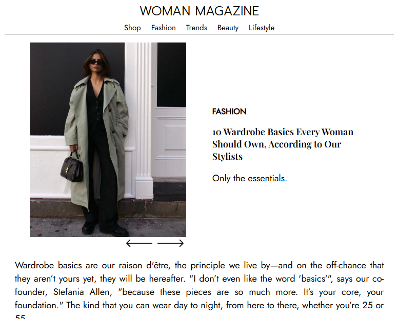
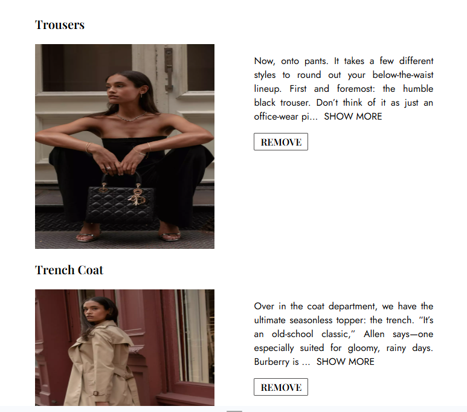

# Top 10 Wardrobe Essentials Checklist

A simple checklist application for tracking essential wardrobe items, built with React.

## Features

- **React `useState`** for managing the application state.  
- **Functional components** for modular and maintainable code.  
- **Dynamic rendering** using `.map()` to display data from arrays.  
- **Interactive UI** with the ability to remove individual items from the checklist.  
- **Image slider** showcasing wardrobe essentials sourced from an array of data.

## Technologies Used

- **React**: Functional components and hooks.
- **JavaScript**: Core logic and interactivity.
- **CSS**: Styling for a clean and modern user interface.

## Support

For questions or suggestions, feel free to open an issue in this repository or reach out via email: `o.nova0804@gmail.com`.

